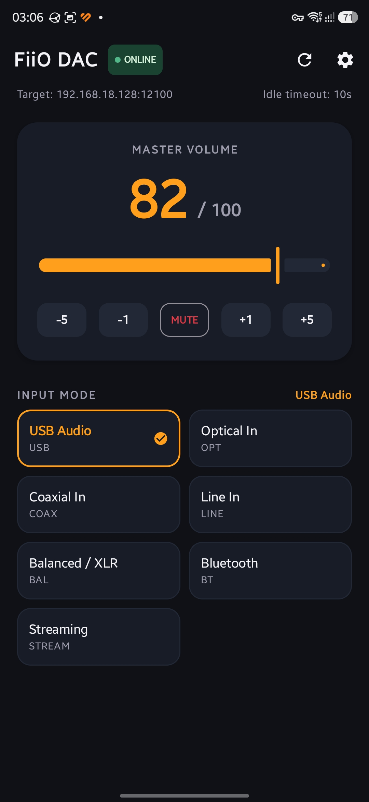
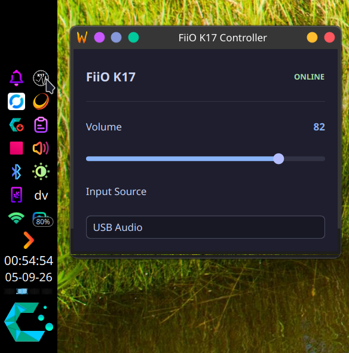

# FiiO Direct Remote Control 

**Currently supports the K17**

The official FiiO Control Android app provides comprehensive control and supports many FiiO devices. I wanted a simpler way to control my device, without waiting for the app to finish its startup checks and navigating through several screens just to reach the K17 controls. Thus, I developed a small app that gives me fast access to K17 volume and input controls from a Linux desktop and Android. This app is built by reverse-engineering the network interaction between the FiiO Control app and the FiiO K17 DAC / Amp over local Wi-Fi / LAN (TCP 12100).

---

## 📸 Screenshots

<p align="center">
  
  &nbsp;&nbsp;
  
</p>

---

## 🌟 Overview

The **FiiO K17** supports local network control over port `12100` (TCP) and discovery over `224.0.0.255:12101` (UDP). This repository contains:

1. **Protocol Specification:** Documentation of discovered wire opcodes, payload formats for input switching and volume control.
2. **Desktop System Tray (Linux / KDE Plasma):** Lightweight Python/PyQt6 system tray controller with debounced volume control, input switching, and automatic device reconnect. Mouse scrollwheel on the tray icon changes volume. The desktop client separates the platform-independent K17 protocol/networking core from the current KDE Plasma/PyQt6 frontend, making additional desktop frontends possible without duplicating the K17 communication layer.
3. **Android Application & Widget:** Modern Kotlin/Jetpack Compose app with Home Screen Glance widgets, hardware volume rocker control, and quick input switching. On my phone, a cold launch connects to the K17 in about 2 seconds over Wi-Fi. It also provides optional volume control through a Media notification and a home-screen volume control widget. No loading screen on subsequent app opens.

---

## 📑 Repository Structure

- [`K17Protocol.md`](K17Protocol.md) — Reverse-engineered network protocol documentation (UDP discovery, TCP commands, JSON payloads, input multiplexing).
- [`desktop-app/`](desktop-app/) — Python 3 & PyQt6 desktop system tray client ([Design Plan](DesktopPlan.md)).
- [`android-app/`](android-app/) — Android native app & Glance home screen widget ([Design Plan](AndroidPlan.md)).

---

## 🚀 Getting Started

### Desktop Tray App (Linux / KDE Plasma)

#### One-Line Installation (Frictionless)
```bash
curl -fsSL https://raw.githubusercontent.com/benedictjohannes/fiio-direct-remote/master/desktop-app/install_linux.sh | bash
```

The script sets up desktop integration (`.desktop` menu launcher, SVG icon, `fiio-tray` command) and configures autostart via standard XDG autostart or `systemd --user`.

#### Manual / From Cloned Source
```bash
cd desktop-app
./install_linux.sh
```
Or run directly:
```bash
python3 main.py
```

### Android App

#### Download APK
Download the latest prebuilt APK from the [GitHub Releases](https://github.com/benedictjohannes/fiio-direct-remote/releases/tag/android-latest) page (`fiio-direct-remote.apk`).

#### Build from Source
Open the [`android-app/`](android-app/) directory in Android Studio or build with Gradle:
```bash
cd android-app
./gradlew assembleDebug
```

---

## 📄 License

This project is licensed under the [MIT License](LICENSE).
